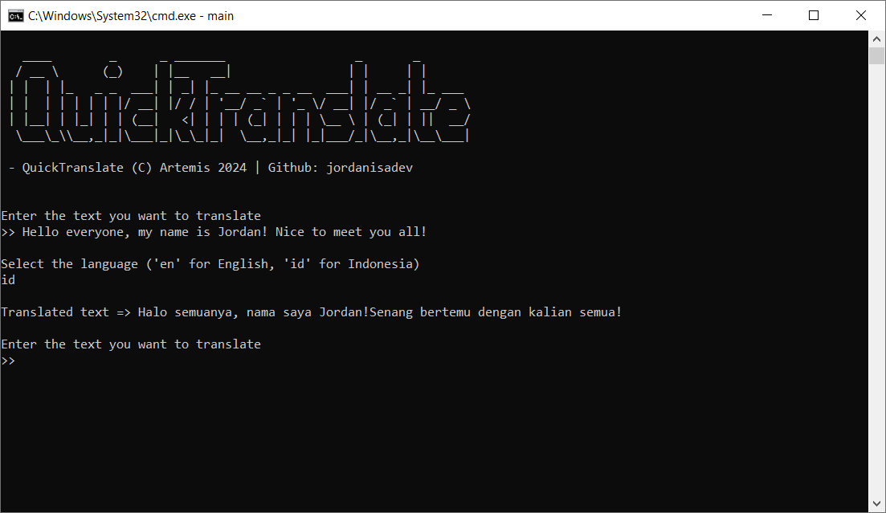

## 🔍 QuickTranslate

**QuickTranslate** is an open source program coded in Python where its main purpose is to translate things to other language you want.
#### 🌍 Supported Language
**QuickTranslate** supports all languages in the world, just type in the country code and it'll do the rest
> Example: **fr** for France
## 📜 Dependencies
- Python 3.12
- Googletrans
## 👤 Contact
- Github: [Jordan](https://github.com/jordanisadev) (JordanIsADev)